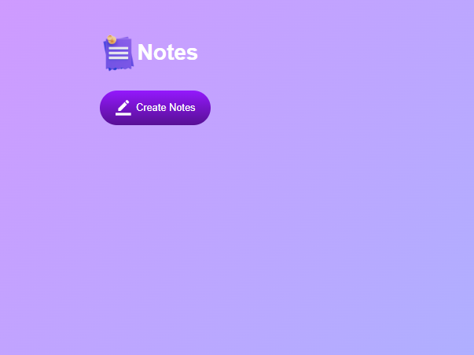
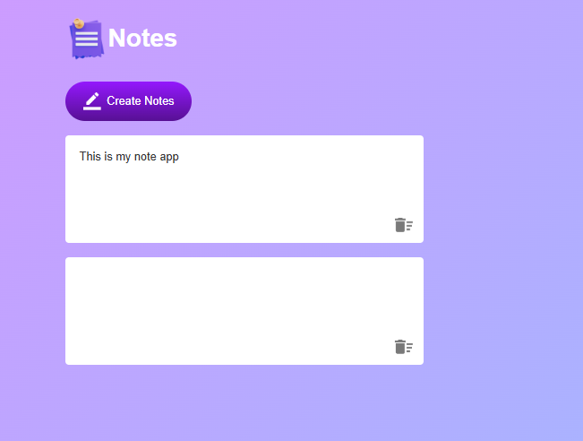

# 🗒️ ノートアプリ

**HTML / CSS / JavaScript** だけで動くシンプルなノートアプリ。
ノートの作成・その場編集・自動保存・削除ができます。

---

## 学んだこと

このプロジェクトでは **DOM の組み立て**, **イベント委任**, **localStorage** を中心に学びました。

### JavaScript スキル

* **DOM 取得 & 要素生成**

  * `document.querySelector()` で要素取得
  * `document.createElement()` でノートを動的生成
* **イベント処理（委任）**

  * コンテナの `click` で削除アイコン(IMG)のクリックを検知
  * ノートの `input` で入力内容を即保存
* **データ属性**

  * `dataset.index` で `<p>` と配列インデックスを紐づけ
* **ローカル保存（JSON）**

  * `localStorage.setItem()` / `getItem()` を `JSON.stringify()` / `JSON.parse()` と併用
  * `try...catch` で安全にパース、配列チェック
* **UI 挙動**

  * `contentEditable="true"` によるインライン編集
  * 新規作成後に最新ノートへ自動フォーカス

### HTML / CSS

* **HTML**：ボタン、編集可能な段落、アイコン画像
* **CSS**：

* グラデーション背景、角丸ボタン、余白の調整

---

## 機能

* **ワンクリックで新規ノート作成**
* **その場編集（contentEditable）**
* **キーストロークごとに自動保存**
* **localStorage で永続化（オフラインでも保持）**
* **ゴミ箱アイコンで削除**
* **新規作成後に自動フォーカス**
* **入力した改行をそのまま表示**

---

## フォルダ構成

```
Notes-App/
├── images/
│   ├── notes.png
│   └── delete.png
├── css/
│   └── style.css
├── js/
│   └── scriptC.js
├── index.html
└── README.ja.md
```

---

## 仕組み

1. **ロード**
   `loadNotes()` が `localStorage` のキー **`notes.v1`** を読み込み、JSON を安全にパース。配列でなければ `[]` を返す。

2. **レンダリング**
   `render()` が `.notes-container` をクリアし、各ノートごとに

   * `<p class="input-box" contentEditable="true">` を生成
   * `p.dataset.index = idx` をセット
   * 同じ `data-index` を持つ削除用 `` を追加
   * コンテナに挿入

3. **編集**
   `notesContainer.addEventListener('input', ...)` で `notes[idx] = e.target.innerText` に更新し `saveNotes()`。

4. **削除**
   `notesContainer.addEventListener('click', ...)` で `e.target.tagName === 'IMG'` を判定し、`idx` を取得して `splice` → 保存 → 再描画。

5. **作成**
   ボタンで `''` を配列に `push` → 保存 → 再描画 → 最後のノートへフォーカス：

   ```js
   const last = notesContainer.querySelector('.input-box:last-of-type');
   if (last) last.focus();
   ```

---

## デモ

[🔗 デモを見る](noteapp1630.netlify.app)

---

## プレビュー




---

## 作者

**Aman Rai**  
JavaScript を中心に学習中のビギナー Web 開発者  
東京都在住  
対応言語: 英語 / ヒンディー語 / ネパール語 / 日本語 (N3)
